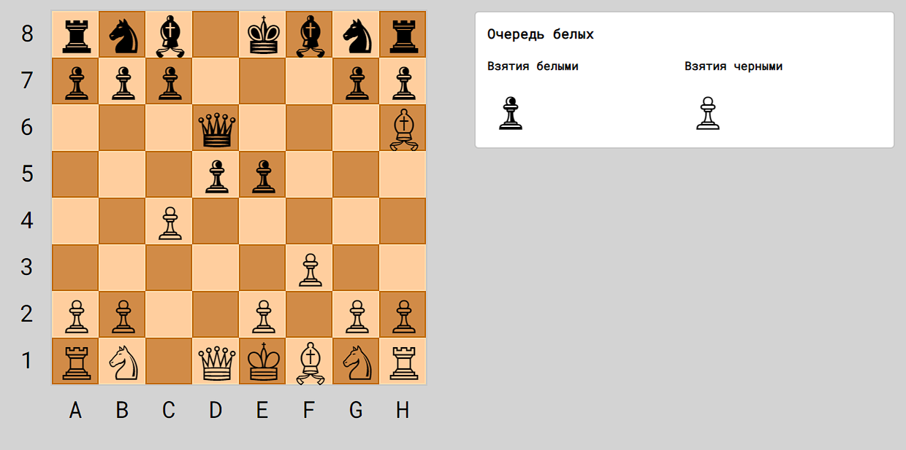

# Chess.js



Моя реализация шахмат на ES6. Работает скорее всего только в последнем хроме.  
Поддерживается рокировка и взятие на проходе. Так же есть счет и порядок ходов. Конец игры не реализован.  

Для отображения всех доступных ходов можно воспользоватся функцией:
```
game.showAvailableMoves(color = false)
```
Работает из консоли браузера.  
color может быть white или black.

Для задания расположения фигур используется функция:
```
game.board.fillStartingPositions()
```
В ней задается необходимое расположение фигур.

## Известные ошибки
* Король может делать рокировку под шахом
* Король может делать рокировку под шах
* Пешка не превращается при достижении противоположной стороны